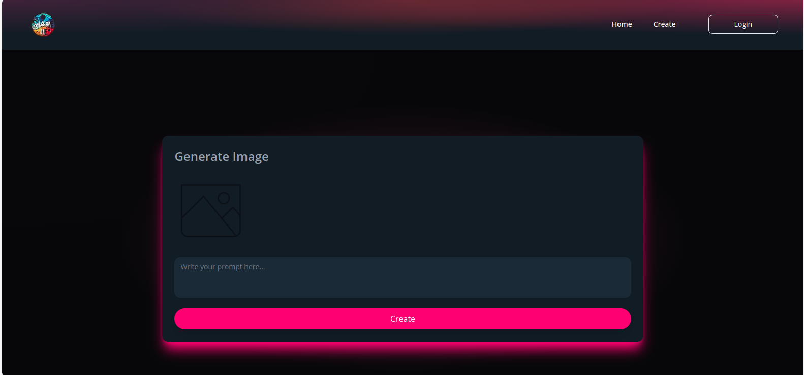
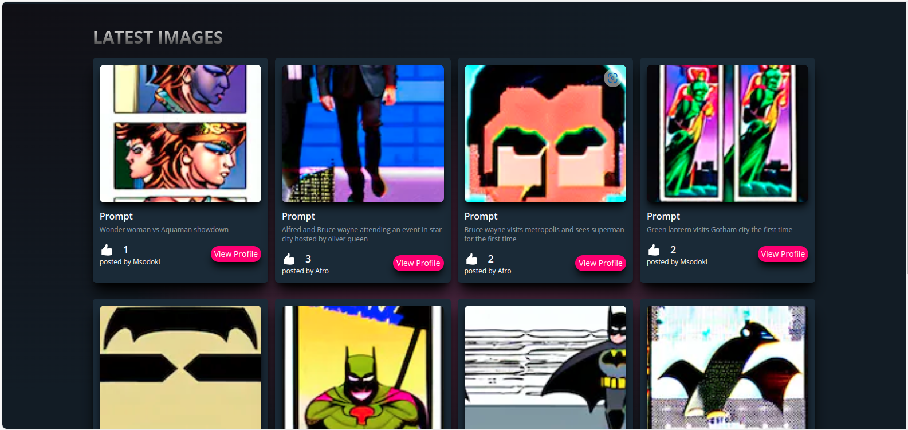

# ShareME

ShareME is a full-stack TypeScript project for sharing AI-generated images. It uses Next.js for the frontend, Nest.js for the backend, and PostgreSQL for the database. The images are generated using getimg.io and stored in Azure Blob Storage. The backend is hosted on Azure App Service.

## Project Structure

The project is divided into two main directories:

- `client`: This directory contains the Next.js frontend application.
- `server`: This directory contains the Nest.js backend application.

## Images

Here are some images of the project:

## Features

- **AI-Generated Images**: ShareME uses getimg.io to generate unique AI images that users can share.
- **Voting Functionality**: Users can vote for their favorite images. To vote, users must be logged in.
- **Azure Blob Storage**: All images are stored securely in Azure Blob Storage, ensuring high availability and reliability.
- **Azure App Service**: The backend is hosted on Azure App Service, providing robust and scalable hosting for our Nest.js application.
- **Authentication**: Users must be logged in to vote, ensuring that voting is fair and authenticated.

## Technologies Used

- **Next.js**: A React framework for building the frontend of the application.
- **Nest.js**: A progressive Node.js framework for building efficient and scalable server-side applications.
- **PostgreSQL**: A powerful, open-source object-relational database system.
- **Azure Blob Storage**: An object storage solution for the cloud. Blob Storage can handle all your unstructured data, images, videos and more.
- **Azure App Service**: A fully managed platform for building, deploying, and scaling your web apps.
- **Tailwind CSS**: A utility-first CSS framework for rapidly building custom user interfaces.

## Environment Variables

To run this project, you will need to add the following environment variables to your `.env` file:

- `GETIMG_API_URL`
- `AZURE_BLOB_STORAGE_CONNECTION_STRING`
- `AZURE_BLOB_STORAGE_CONTAINER_NAME`
- `AZURE_APP_SERVICE_CONNECTION_STRING`
- `POSTGRES_CONNECTION_STRING`
- `NEXT_PUBLIC_API_URL`
- `SESSION_SECRET`

Add these variables to a `.env` file in both the `client` and `server` directories.

## Getting Started

To get a local copy up and running, follow these steps:

1. Clone the repository.
2. Install the dependencies in both the `client` and `server` directories with `npm install`.
3. Set up your environment variables in a `.env` file in both the `client` and `server` directories.
4. Run the development server in the `client` directory with `npm run dev`.
5. Run the development server in the `server` directory with `npm run start`.

## Contributing

Contributions are what make the open-source community such an amazing place to learn, inspire, and create. Any contributions you make are greatly appreciated.

1. Fork the project.
2. Create your feature branch (`git checkout -b feature/AmazingFeature`).
3. Commit your changes (`git commit -m 'Add some AmazingFeature'`).
4. Push to the branch (`git push origin feature/AmazingFeature`).
5. Open a pull request.

## License

Distributed under the MIT License. See `LICENSE` for more information.

## Contact

ianmuchesia78@gmail.com
Project Link: https://github.com/ianMuchesia/Share-Me
